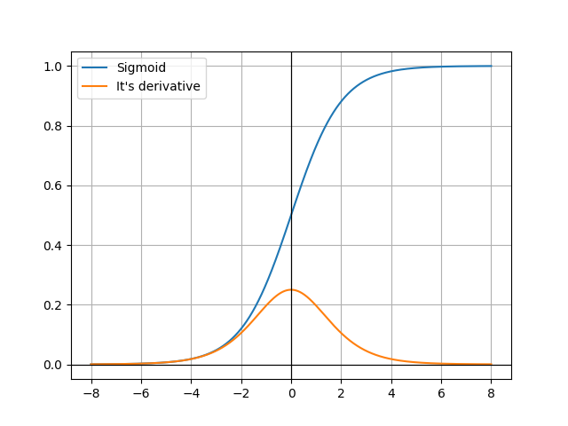
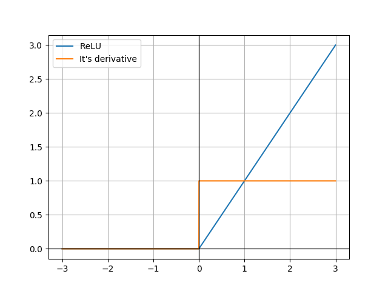
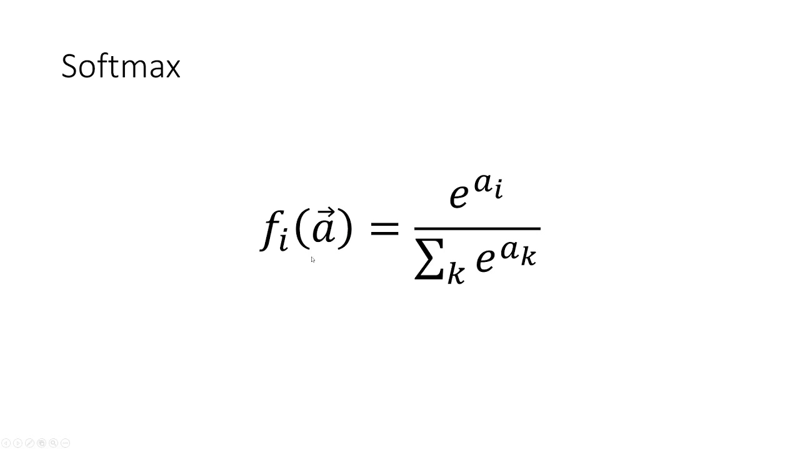

# Neural Networks

My implementation of different neural network models from scratch in Python

## NN Models

* HopField Network

## Activation Functions

It's part in the **Nerual Networks**, which says whether the neuron should be active or not.

* *Sigmoid*

It is a characteristic S-shaped function; the domain of the function is R, which maps to a range of [0, 1], also called a logistic function.

* *ReLU*

It is a piecewise function, which outputs the number itself if +ve else 0.

* Softmax

It's a mathematical function which gives a normalized exponential vector of n-input vector, which is probabilistic distribution.

## Assignments

> Check the readme's in the dirctoeies for more description

* assignment1: Implementing Single layer Perception

* assignment2: Implementing Hopfield network
